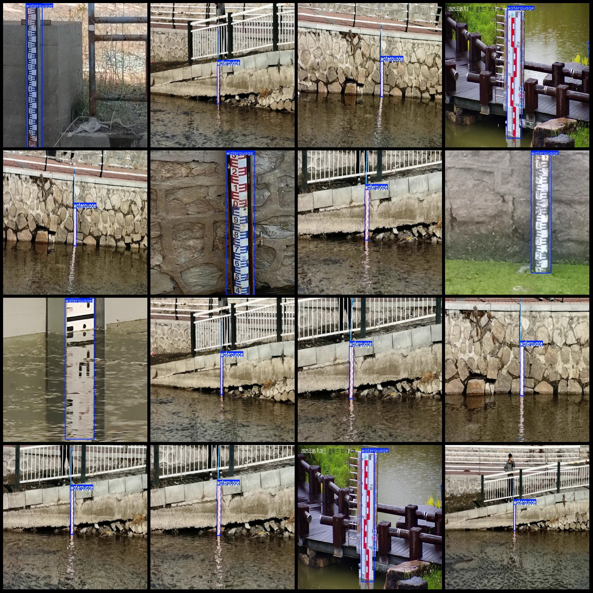
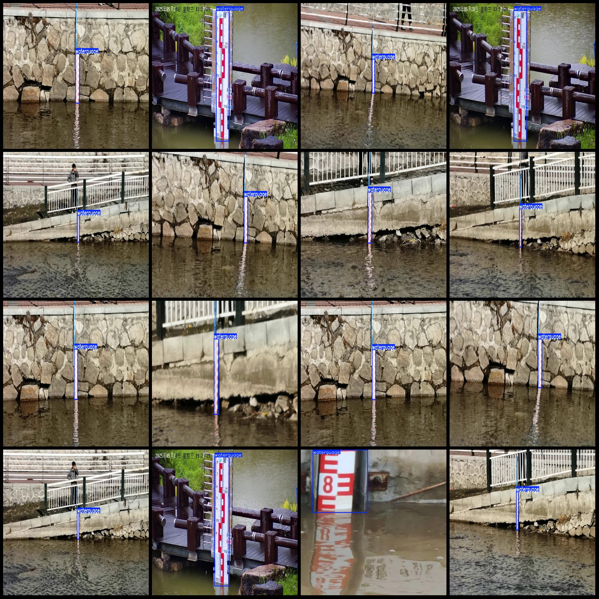

# River Inspection Data Set with River Level Measuring Scales and Detection in VOC+YOLO format, 317 images of 1 category

The dataset format: Pascal VOC format + YOLO format (txt files without segmentation paths, only containing jpg images and corresponding VOC format xml files and YOLO format txt files)
Number of images (jpg file count): 317
Number of labels (xml file count): 317
Number of labels (txt file count): 317
Number of label categories: 1
Label category names: ["waterguage"]
Number of boxes per category: 
waterguage boxes = 319
Total boxes: 319
Number of images per category: 
waterguage images = 317
Image resolution: 640x640
Used labeling tool: labelImg
Labeling rules: Draw a box around the category
Important note: The dataset does not have separate training validation test sets to be divided.
Special Disclaimer: This dataset does not guarantee the accuracy of the trained model or the weight files.
Preview of images:
## Images

Here is a pay link on Stripe ( https://buy.stripe.com/3cs8yP7sY87d0vu9AB ). Please contact me lonlonago@foxmail.com after funding $89, and I will send you a complete data files , thank you!

